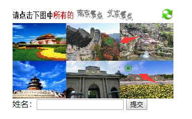

验证码组件
=================
&nbsp;&nbsp;&nbsp;&nbsp;验证码组件提供了一套验证码二次校验的后台实现，其中captcha是作为验证码服务提供后台，captcha-java-demo为第三方接入验证码的示例（JAVA版本，其中包括SDK和前端js包）。

# 1. 部署效果

&nbsp;&nbsp;&nbsp;&nbsp;captcha验证码服务端启动好后，启动captcha-java-demo，展示类似12306图片组合验证码，根据问题，选择正确的图片，然后提交。目前前端用户体验从多方面优化：

&nbsp;&nbsp;&nbsp;&nbsp;1）选中图片会在点击位置添加一个标记；

&nbsp;&nbsp;&nbsp;&nbsp;2）在同一个图片上面多次点击，不会出现多个标记，优化用户体验；

&nbsp;&nbsp;&nbsp;&nbsp;3）在图片的边缘位置点击，可能出现不确定性，因此在边缘位置点击无效；

&nbsp;&nbsp;&nbsp;&nbsp;4）在图片上面点击后，再在同样位置点击，可以取消“选中”，去掉该点击的点。
