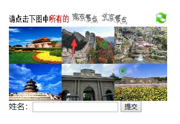
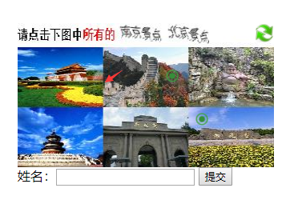
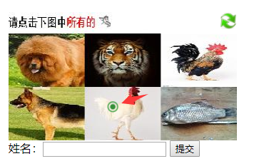
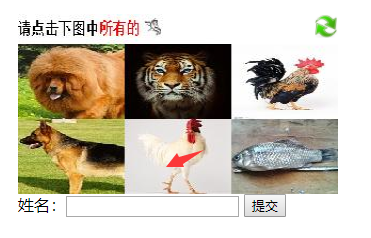
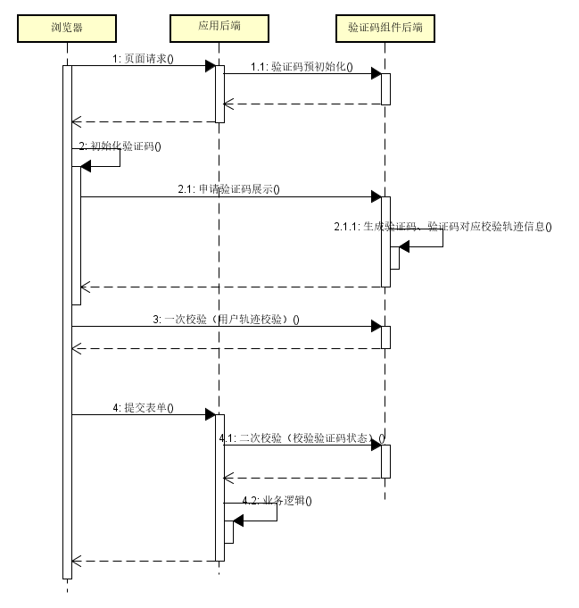

验证码组件
=================
&nbsp;&nbsp;&nbsp;&nbsp;验证码校验技术是继传统验证码后新一代校验安全技术。验证码组件提供了一套验证码二次校验的后台实现，其中captcha是作为验证码服务提供后台，captcha-java-demo为第三方接入验证码的示例（JAVA版本，其中包括SDK和前端js包）。

# 1. 部署效果

&nbsp;&nbsp;&nbsp;&nbsp;captcha验证码服务端启动好后，启动captcha-java-demo，展示类似12306图片组合验证码，根据问题，选择正确的图片，然后提交。目前前端用户体验从多方面优化：

&nbsp;&nbsp;&nbsp;&nbsp;1）选中图片会在点击位置添加一个标记；（标记如下图箭头所示）

&nbsp;&nbsp;&nbsp;&nbsp;2）在同一个图片上面多次点击，不会出现多个标记，优化用户体验；（图中箭头处点击不会添加新的标记）

&nbsp;&nbsp;&nbsp;&nbsp;3）在图片的边缘位置点击，可能出现不确定性，因此在边缘位置点击无效；（图中箭头处点击无效）

&nbsp;&nbsp;&nbsp;&nbsp;4）在图片上面点击后，再在同样位置点击，可以取消“选中”，去掉该点击的点。（图中箭头处再次点击，标记取消）

 &nbsp;&nbsp;&nbsp; 

# 2. 基础概念

<table>
  <tr>
    <th width=20%, bgcolor=yellow >概念</th>
    <th width=80%, bgcolor=yellow>描述</th>
  </tr>
  <tr>
    <td bgcolor=#eeeeee> 验证码标示 </td>
    <td> captchaId
         使用验证码组件需要申请的唯一标示，公开可见，可用于区分不同验证码的使用场景，也可以作为后期验证码服务组件提供收费标准的判断依据
 </td>
  </tr>
  <tr>
    <td bgcolor=#00FF00> 验证码请求标示 </td>
    <td> challengeId
         验证码校验请求的唯一标示，验证码工作中可见，可用于区分不同的验证码请求
 </td>
  </tr>
  <tr>
    <td bgcolor=rgb(0,10,0)> 预处理 </td>
    <td>  若需要使用验证码组件，需要在接入应用的后端向验证码服务后端申请，申请返回的就是验证码请求标示，这个过程称为验证码预处理 </td>
  </tr>
  <tr>
      <td bgcolor=rgb(0,10,0)> 一次校验 </td>
      <td>  验证码预处理后，根据challengeId渲染验证码，用户拖动/点击验证码，将用户轨迹信息提交到后端进行校验，这个过程称为验证码一次校验</td>
    </tr>
 <tr>
      <td bgcolor=rgb(0,10,0)> 二次校验 </td>
      <td> 验证数据随表单提交到接入应用后端，在处理应用后端业务逻辑之前，需要判断校验状态，需要根据challengeId请求验证码服务后端，判断验证码校验状态，这个过程称为验证码二次校验</td>
    </tr>
 <tr>
      <td bgcolor=rgb(0,10,0)> 私钥 </td>
      <td> secretKey
           验证码服务端接口请求，参数需要签名，用于对预处理和二次校验接口参数签名计算使用
</td>
    </tr>
</table>

# 3. 验证码工作流程图

